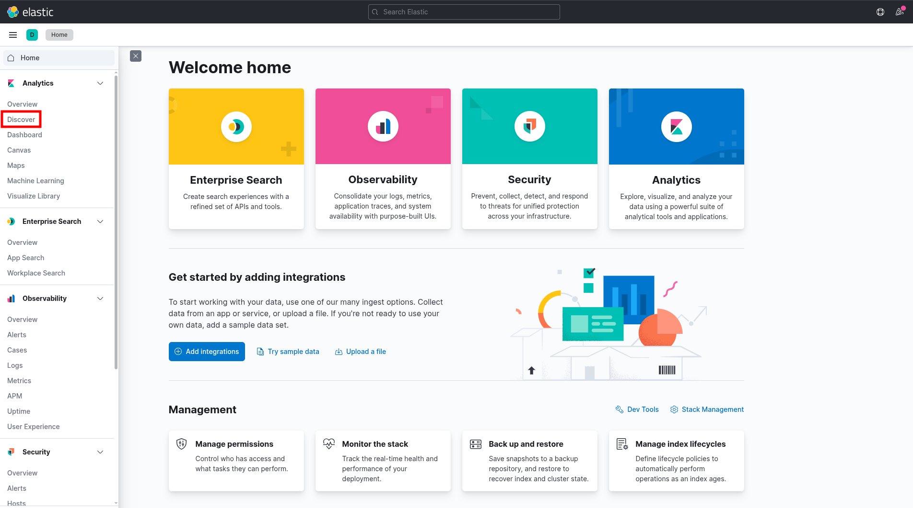
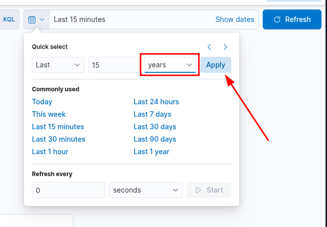

## KQL (Kibana Query Language)

Kibana Query Language (KQL) is a powerful and user-friendly query language designed specifically for searching and analyzing data in Kibana.

### Basic Structure
KQL queries are composed of field:value pairs, with the field representing the data's attribute and the value representing the data you're searching for.
```
event.code:4625
```

The KQL query event.code:4625 filters data in Kibana to show events that have the [Windows event code 4625](https://www.ultimatewindowssecurity.com/securitylog/encyclopedia/event.aspx?eventid=4625). This Windows event code is associated with failed login attempts in a Windows operating system.


### Free Text Search
KQL supports free text search, allowing you to search for a specific term across multiple fields without specifying a field name. For instance:
```
"svc-sql1"
```
This query returns records containing the string "svc-sql1" in any indexed field.


### Logical Operators
KQL supports logical operators AND, OR, and NOT for constructing more complex queries. Parentheses can be used to group expressions and control the order of evaluation. For example:
```
event.code:4625 AND winlog.event_data.SubStatus:0xC0000072
```
The KQL query **event.code:4625 AND winlog.event_data.SubStatus:0xC0000072** filters data in Kibana to show events that have the Windows event code 4625 (failed login attempts) and the SubStatus value of 0xC0000072. In Windows, the SubStatus value indicates the reason for a login failure. A SubStatus value of 0xC0000072 indicates that the account is currently disabled. By using this query, SOC analysts can identify failed login attempts against disabled accounts. Such a behavior requires further investigation, as the disabled account's credentials may have been identified somehow by an attacker.

### Comparison Operators
KQL supports various comparison operators such as :, :>, :>=, :<, :<=, and :!. These operators enable you to define precise conditions for matching field values.
```
event.code:4625 AND winlog.event_data.SubStatus:0xC0000072 AND @timestamp >= "2023-03-03T00:00:00.000Z" AND @timestamp <= "2023-03-06T23:59:59.999Z"
```
By using this query, SOC analysts can identify failed login attempts against disabled accounts that took place between March 3rd 2023 and March 6th 2023.

### Wildcar and regular expressions
KQL supports wildcards and regular expressions to search for patterns in field values.
```
event.code:4625 AND user.name: admin*
```
The Kibana KQL query event.code:4625 AND user.name: admin* filters data in Kibana to show events that have the Windows event code 4625 (failed login attempts) and where the username starts with "admin", such as "admin", "administrator", "admin123", etc.
This query (if extended) can be useful in identifying potentially malicious login attempts targeted at administrator accounts.

### How To Identify The Available Data

**Example**: Identify failed login attempts against disabled accounts that took place between March 3rd 2023 and March 6th 2023 KQL:

```
event.code:4625 AND winlog.event_data.SubStatus:0xC0000072 AND @timestamp >= "2023-03-03T00:00:00.000Z" AND @timestamp <= "2023-03-06T23:59:59.999Z"
```

**Data and field identification approach 1: Leverage KQL's free text search**

Using the [Discover](https://www.elastic.co/docs/explore-analyze/discover) feature, we can effortlessly explore and sift through the available data, as well as gain insights into the architecture of the available fields, before we start constructing KQL queries.

- By using a search engine for the Windows event logs that are associated with failed login attempts, we will come across resources such as https://www.ultimatewindowssecurity.com/securitylog/encyclopedia/event.aspx?eventid=4625
- Using KQL's free text search we can search for **"4625"**. In the returned records we notice **event.code:4625**, **winlog.event_id:4625**, and **@timestamp**
    - **event.code** is related to the [Elastic Common Schema (ECS)](https://www.elastic.co/docs/reference/ecs/ecs-event#field-event-code)
    - **winlog.event_id** is related to [Winlogbeat](https://www.elastic.co/docs/reference/beats/winlogbeat/exported-fields-winlog)
    - If the organization we work for is using the Elastic stack across all offices and security departments, it is preferred that we use the ECS fields in our queries for reasons that we will cover at the end of this section.
    - @timestamp typically contains the time extracted from the original event and it is [different from event.created](https://discuss.elastic.co/t/winlogbeat-timestamp-different-with-event-create-time/278160)


- When it comes to disabled accounts, the aforementioned resource informs us that a SubStatus value of 0xC0000072 inside a 4625 Windows event log indicates that the account is currently disabled. Again using KQL's free text search we can search for "0xC0000072". By expanding the returned record we notice winlog.event_data.SubStatus that is related to Winlogbeat


**Data and field identification approach 2: Leverage Elastic's documentation**

It could be a good idea to first familiarize ourselves with Elastic's comprehensive documentation before delving into the "Discover" feature. The documentation provides a wealth of information on the different types of fields we may encounter. Some good resources to start with are:

- https://www.elastic.co/docs/reference/ecs
- https://www.elastic.co/docs/reference/ecs/ecs-event
- https://www.elastic.co/docs/reference/beats/winlogbeat/exported-fields-winlog
- https://www.elastic.co/docs/reference/beats/winlogbeat/exported-fields-ecs
- https://www.elastic.co/docs/reference/beats/winlogbeat/exported-fields-security
- https://www.elastic.co/docs/reference/beats/filebeat/exported-fields
- https://www.elastic.co/docs/reference/beats/filebeat/exported-fields-ecs

---







Identify failed login attempts against disabled accounts that took place between March 3rd 2023 and March 6th 2023
```
event.code:4625 AND winlog.event_data.SubStatus:0xC0000072 AND @timestamp >= "2023-03-03T00:00:00.000Z" AND @timestamp <= "2023-03-06T23:59:59.999Z"
```

1. Query  
2. Only windows logs  
3. The result  


And we can see all the information related


