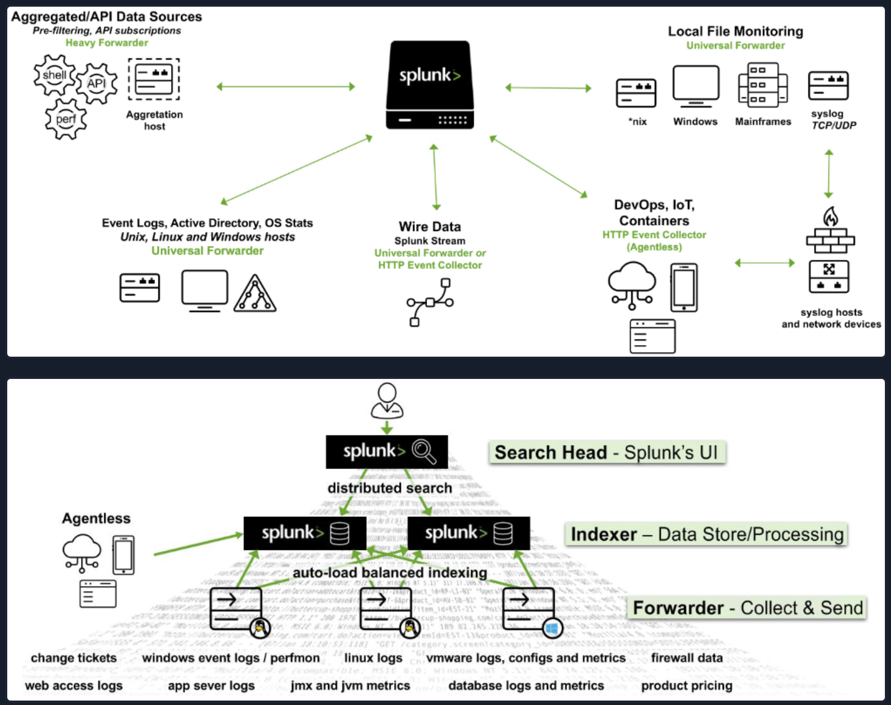

<h1 align="center">Introduction To Splunk & SPL</h1>

Splunk is a highly scalable, versatile, and robust data analytics software solution known for its ability to ingest, index, analyze, and visualize massive amounts of machine data. Splunk has the capability to drive a wide range of initiatives, encompassing cybersecurity, compliance, data pipelines, IT monitoring, observability, as well as overall IT and business management.

