# Using Sigma CLI to Convert a Single Rule

```
python3 -m venv venv
source venv/bin/activate
```

```
pipx install sigma-cli
```

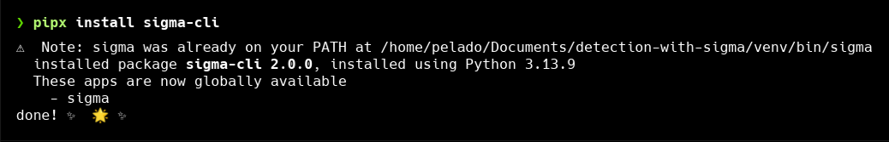

```
 pipx ensurepath
```

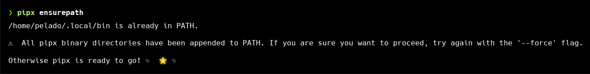

```
sigma plugin install splunk
```

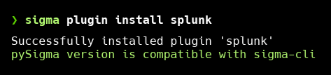

---

We going to convert this rule into SPL and savedsearches.conf format

```
title: Suspicious Cobalt Strike DNS Beaconing - Sysmon
id: f356a9c4-effd-4608-bbf8-408afd5cd006
related:
    - id: 0d18728b-f5bf-4381-9dcf-915539fff6c2
      type: similar
status: test
description: Detects a program that invoked suspicious DNS queries known from Cobalt Strike beacons
references:
    - https://www.icebrg.io/blog/footprints-of-fin7-tracking-actor-patterns
    - https://www.sekoia.io/en/hunting-and-detecting-cobalt-strike/
author: Florian Roth (Nextron Systems)
date: 2021-11-09
modified: 2023-01-16
tags:
    - attack.command-and-control
    - attack.t1071.004
logsource:
    product: windows
    category: dns_query
detection:
    selection1:
        QueryName|startswith:
            - 'aaa.stage.'
            - 'post.1'
    selection2:
        QueryName|contains: '.stage.123456.'
    condition: 1 of selection*
falsepositives:
    - Unknown
fields:
    - Image
    - CommandLine
level: critical
```

```
sigma convert --target splunk --pipeline splunk_windows rule01/
```

The result is the rule converted to SPL.
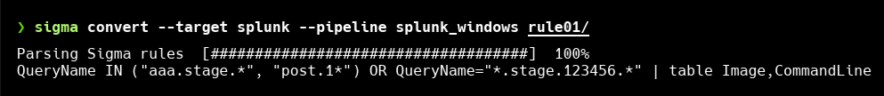

Now, change the output format to the savedsearches.conf format that Splunk will use to create automatically scheduled searches.

```
sigma convert --format savedsearches --target splunk --pipeline splunk_windows rule01/
```

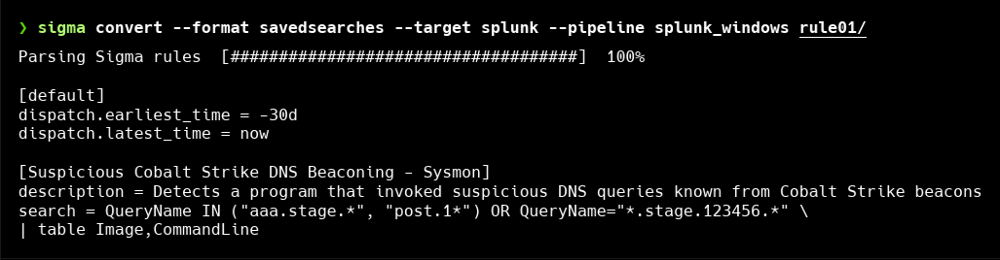

```
[default]
dispatch.earliest_time = -30d
dispatch.latest_time = now

[Suspicious Cobalt Strike DNS Beaconing - Sysmon]
description = Detects a program that invoked suspicious DNS queries known from Cobalt Strike beacons
search = QueryName IN ("aaa.stage.*", "post.1*") OR QueryName="*.stage.123456.*" \
| table Image,CommandLine
```

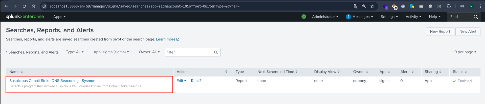

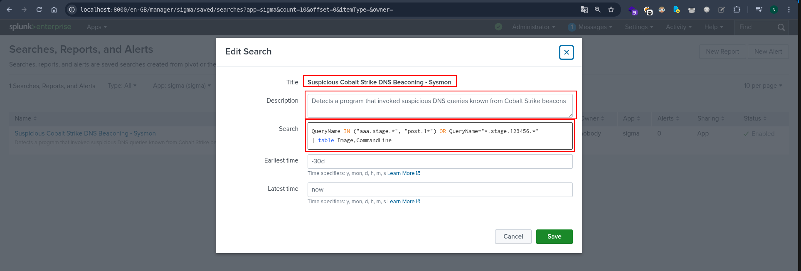

This search will not actually find any results in your production environment. Additionally, the search does not have any instructions on how often it should run as we did not define any schedule.

---

## Convert another rule

```
title: Exploitation Activity of CVE-2025-59287 - WSUS Suspicious Child Process
id: 43259cc4-1b80-4931-bd98-baea01afc196
status: experimental
description: |
    Detects the creation of command-line interpreters (cmd.exe, powershell.exe) as child processes of Windows Server Update Services (WSUS) related process wsusservice.exe.
    This behavior is a key indicator of exploitation for the critical remote code execution vulnerability such as CVE-2025-59287, where attackers spawn shells to conduct reconnaissance and further post-exploitation activities.
references:
    - https://unit42.paloaltonetworks.com/microsoft-cve-2025-59287/
    - https://www.huntress.com/blog/exploitation-of-windows-server-update-services-remote-code-execution-vulnerability
    - https://hawktrace.com/blog/CVE-2025-59287-UNAUTH
author: Huntress Labs, Swachchhanda Shrawan Poudel (Nextron Systems)
date: 2025-10-31
tags:
    - attack.execution
    - attack.initial-access
    - attack.t1190
    - attack.t1203
    - cve.2025-59287
    - detection.emerging-threats
logsource:
    category: process_creation
    product: windows
detection:
    selection_parent_wsusservice:
        ParentImage|endswith: '\wsusservice.exe'
    selection_parent_w3wp_wsuspool:
        ParentImage|endswith: '\w3wp.exe'
        ParentCommandLine|contains: 'WsusPool'
    selection_child:
        Image|endswith:
            - '\cmd.exe'
            - '\powershell.exe'
            - '\pwsh.exe'
            - '\powershell_ise.exe'
    condition: 1 of selection_parent_* and selection_child
falsepositives:
    - If this activity is expected, consider filtering based on specific command lines, user context (e.g., `nt authority\network service`), or parent process command lines to reduce noise.
level: high
```

```
sigma convert --target splunk --pipeline splunk_windows rule02/
```

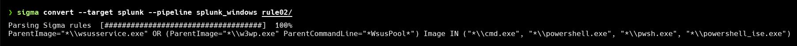

```
sigma convert --format savedsearches --target splunk --pipeline splunk_windows rule02/
```

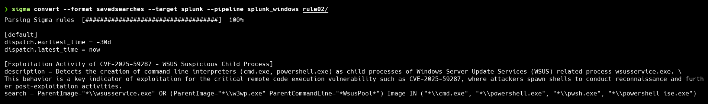

```
[default]
dispatch.earliest_time = -30d
dispatch.latest_time = now

[Exploitation Activity of CVE-2025-59287 - WSUS Suspicious Child Process]
description = Detects the creation of command-line interpreters (cmd.exe, powershell.exe) as child processes of Windows Server Update Services (WSUS) related process wsusservice.exe. \
This behavior is a key indicator of exploitation for the critical remote code execution vulnerability such as CVE-2025-59287, where attackers spawn shells to conduct reconnaissance and further post-exploitation activities.
search = ParentImage="*\\wsusservice.exe" OR (ParentImage="*\\w3wp.exe" ParentCommandLine="*WsusPool*") Image IN ("*\\cmd.exe", "*\\powershell.exe", "*\\pwsh.exe", "*\\powershell_ise.exe")
```

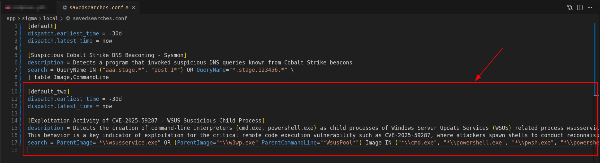

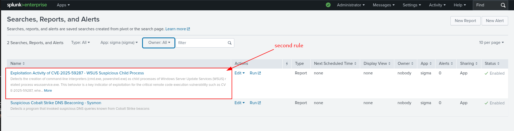

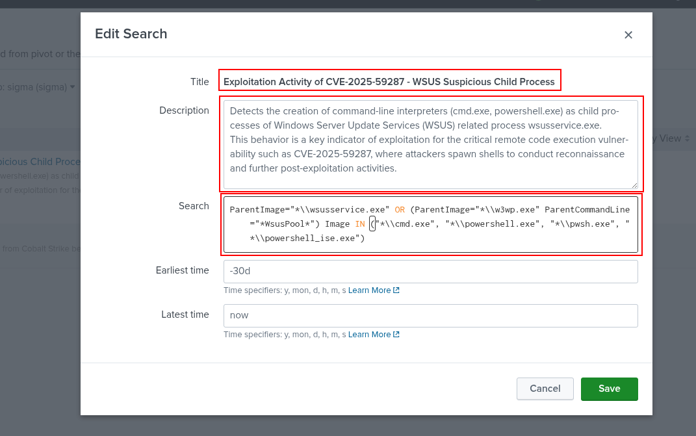