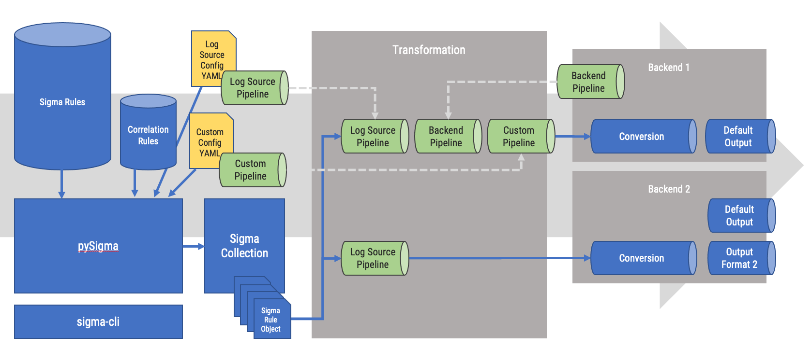
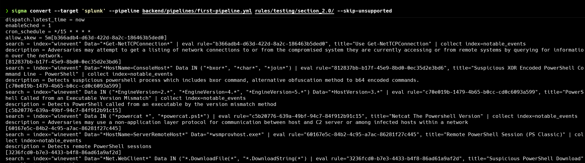
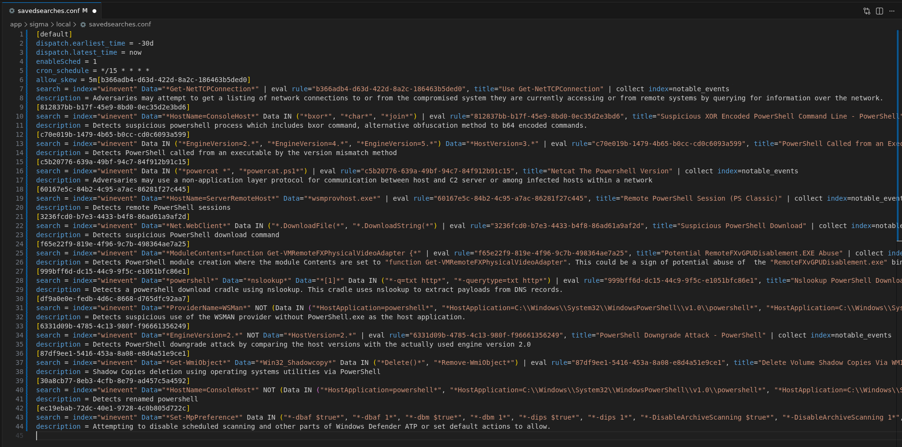
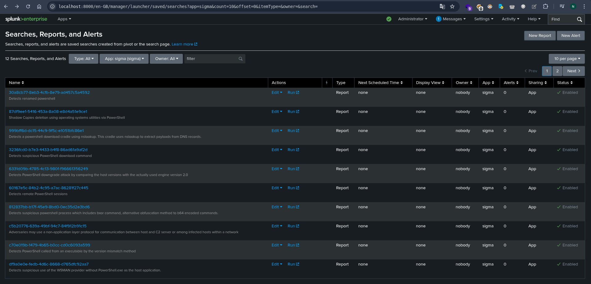
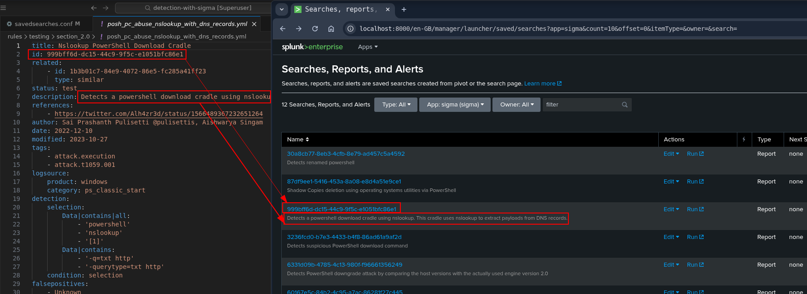
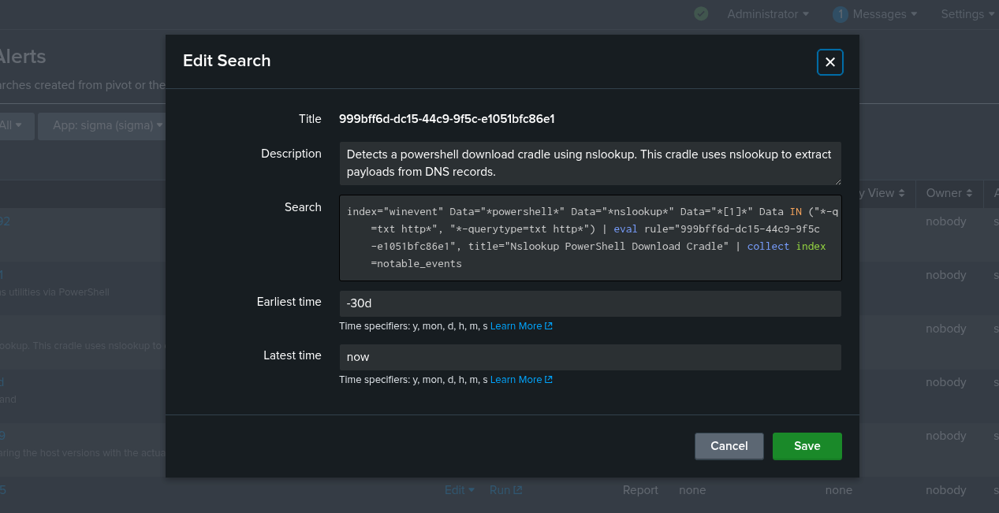

# pySigma Pipelines

> pipeline in Sigma: any tool that uses the PySigma Python library to transform the standard yaml format of Sigma into a detection that will be interpreted by a SIEM.

[https://sigmahq-pysigma.readthedocs.io/en/latest/](https://sigmahq-pysigma.readthedocs.io/en/latest/)



---

This file defines how detection rules are transformed into Splunk saved searches. 
```
# Global win eventlog index
transformations:
    - id: index_condition
      type: add_condition
      conditions:
          index: winevent
      rule_conditions:
          - type: logsource
            product: windows

postprocessing:
  - type: template
    template: |
        [{{ rule.id }}]
        search = {{ query }} | eval rule="{{ rule.id }}", title="{{ rule.title }}" | collect index=notable_events
        description = {{ rule.description }}

finalizers:
- type: concat
  prefix: |
      [default]
      dispatch.earliest_time = -30d
      dispatch.latest_time = now
      enableSched = 1
      cron_schedule = */15 * * * *
      allow_skew = 5m
```

In other folder we have powershell rules to transform into SPL. 


```
 sigma convert --target 'splunk' --pipeline backend/pipelines/first-pipeline.yml rules/testing/section_2.0/ --skip-unsupported
```



```
sigma convert --target 'splunk' --pipeline backend/pipelines/first-pipeline.yml rules/testing/section_2.0/ --skip-unsupported
Parsing Sigma rules  [####################################]  100%
[default]
dispatch.earliest_time = -30d
dispatch.latest_time = now
enableSched = 1
cron_schedule = */15 * * * *
allow_skew = 5m[b366adb4-d63d-422d-8a2c-186463b5ded0]
search = index="winevent" Data="*Get-NetTCPConnection*" | eval rule="b366adb4-d63d-422d-8a2c-186463b5ded0", title="Use Get-NetTCPConnection" | collect index=notable_events
description = Adversaries may attempt to get a listing of network connections to or from the compromised system they are currently accessing or from remote systems by querying for information over the network.
[812837bb-b17f-45e9-8bd0-0ec35d2e3bd6]
search = index="winevent" Data="*HostName=ConsoleHost*" Data IN ("*bxor*", "*char*", "*join*") | eval rule="812837bb-b17f-45e9-8bd0-0ec35d2e3bd6", title="Suspicious XOR Encoded PowerShell Command Line - PowerShell" | collect index=notable_events
description = Detects suspicious powershell process which includes bxor command, alternative obfuscation method to b64 encoded commands.
[c70e019b-1479-4b65-b0cc-cd0c6093a599]
search = index="winevent" Data IN ("*EngineVersion=2.*", "*EngineVersion=4.*", "*EngineVersion=5.*") Data="*HostVersion=3.*" | eval rule="c70e019b-1479-4b65-b0cc-cd0c6093a599", title="PowerShell Called from an Executable Version Mismatch" | collect index=notable_events
description = Detects PowerShell called from an executable by the version mismatch method
[c5b20776-639a-49bf-94c7-84f912b91c15]
search = index="winevent" Data IN ("*powercat *", "*powercat.ps1*") | eval rule="c5b20776-639a-49bf-94c7-84f912b91c15", title="Netcat The Powershell Version" | collect index=notable_events
description = Adversaries may use a non-application layer protocol for communication between host and C2 server or among infected hosts within a network
[60167e5c-84b2-4c95-a7ac-86281f27c445]
search = index="winevent" Data="*HostName=ServerRemoteHost*" Data="*wsmprovhost.exe*" | eval rule="60167e5c-84b2-4c95-a7ac-86281f27c445", title="Remote PowerShell Session (PS Classic)" | collect index=notable_events
description = Detects remote PowerShell sessions
[3236fcd0-b7e3-4433-b4f8-86ad61a9af2d]
search = index="winevent" Data="*Net.WebClient*" Data IN ("*.DownloadFile(*", "*.DownloadString(*") | eval rule="3236fcd0-b7e3-4433-b4f8-86ad61a9af2d", title="Suspicious PowerShell Download" | collect index=notable_events
description = Detects suspicious PowerShell download command
[f65e22f9-819e-4f96-9c7b-498364ae7a25]
search = index="winevent" Data="*ModuleContents=function Get-VMRemoteFXPhysicalVideoAdapter {*" | eval rule="f65e22f9-819e-4f96-9c7b-498364ae7a25", title="Potential RemoteFXvGPUDisablement.EXE Abuse" | collect index=notable_events
description = Detects PowerShell module creation where the module Contents are set to "function Get-VMRemoteFXPhysicalVideoAdapter". This could be a sign of potential abuse of  the "RemoteFXvGPUDisablement.exe" binary which is known to be vulnerable to module load-order hijacking.
[999bff6d-dc15-44c9-9f5c-e1051bfc86e1]
search = index="winevent" Data="*powershell*" Data="*nslookup*" Data="*[1]*" Data IN ("*-q=txt http*", "*-querytype=txt http*") | eval rule="999bff6d-dc15-44c9-9f5c-e1051bfc86e1", title="Nslookup PowerShell Download Cradle" | collect index=notable_events
description = Detects a powershell download cradle using nslookup. This cradle uses nslookup to extract payloads from DNS records.
[df9a0e0e-fedb-4d6c-8668-d765dfc92aa7]
search = index="winevent" Data="*ProviderName=WSMan*" NOT (Data IN ("*HostApplication=powershell*", "*HostApplication=C:\\Windows\\System32\\WindowsPowerShell\\v1.0\\powershell*", "*HostApplication=C:\\Windows\\SysWOW64\\WindowsPowerShell\\v1.0\\powershell*", "*HostApplication=C:/Windows/System32/WindowsPowerShell/v1.0/powershell*", "*HostApplication=C:/Windows/SysWOW64/WindowsPowerShell/v1.0/powershell*")) | eval rule="df9a0e0e-fedb-4d6c-8668-d765dfc92aa7", title="Suspicious Non PowerShell WSMAN COM Provider" | collect index=notable_events
description = Detects suspicious use of the WSMAN provider without PowerShell.exe as the host application.
[6331d09b-4785-4c13-980f-f96661356249]
search = index="winevent" Data="*EngineVersion=2.*" NOT Data="*HostVersion=2.*" | eval rule="6331d09b-4785-4c13-980f-f96661356249", title="PowerShell Downgrade Attack - PowerShell" | collect index=notable_events
description = Detects PowerShell downgrade attack by comparing the host versions with the actually used engine version 2.0
[87df9ee1-5416-453a-8a08-e8d4a51e9ce1]
search = index="winevent" Data="*Get-WmiObject*" Data="*Win32_Shadowcopy*" Data IN ("*Delete()*", "*Remove-WmiObject*") | eval rule="87df9ee1-5416-453a-8a08-e8d4a51e9ce1", title="Delete Volume Shadow Copies Via WMI With PowerShell" | collect index=notable_events
description = Shadow Copies deletion using operating systems utilities via PowerShell
[30a8cb77-8eb3-4cfb-8e79-ad457c5a4592]
search = index="winevent" Data="*HostName=ConsoleHost*" NOT (Data IN ("*HostApplication=powershell*", "*HostApplication=C:\\Windows\\System32\\WindowsPowerShell\\v1.0\\powershell*", "*HostApplication=C:\\Windows\\SysWOW64\\WindowsPowerShell\\v1.0\\powershell*", "*HostApplication=C:/Windows/System32/WindowsPowerShell/v1.0/powershell*", "*HostApplication=C:/Windows/SysWOW64/WindowsPowerShell/v1.0/powershell*")) | eval rule="30a8cb77-8eb3-4cfb-8e79-ad457c5a4592", title="Renamed Powershell Under Powershell Channel" | collect index=notable_events
description = Detects renamed powershell
[ec19ebab-72dc-40e1-9728-4c0b805d722c]
search = index="winevent" Data="*Set-MpPreference*" Data IN ("*-dbaf $true*", "*-dbaf 1*", "*-dbm $true*", "*-dbm 1*", "*-dips $true*", "*-dips 1*", "*-DisableArchiveScanning $true*", "*-DisableArchiveScanning 1*", "*-DisableBehaviorMonitoring $true*", "*-DisableBehaviorMonitoring 1*", "*-DisableBlockAtFirstSeen $true*", "*-DisableBlockAtFirstSeen 1*", "*-DisableIntrusionPreventionSystem $true*", "*-DisableIntrusionPreventionSystem 1*", "*-DisableIOAVProtection $true*", "*-DisableIOAVProtection 1*", "*-DisableRealtimeMonitoring $true*", "*-DisableRealtimeMonitoring 1*", "*-DisableRemovableDriveScanning $true*", "*-DisableRemovableDriveScanning 1*", "*-DisableScanningMappedNetworkDrivesForFullScan $true*", "*-DisableScanningMappedNetworkDrivesForFullScan 1*", "*-DisableScanningNetworkFiles $true*", "*-DisableScanningNetworkFiles 1*", "*-DisableScriptScanning $true*", "*-DisableScriptScanning 1*", "*-drdsc $true*", "*-drdsc 1*", "*-drtm $true*", "*-drtm 1*", "*-dscrptsc $true*", "*-dscrptsc 1*", "*-dsmndf $true*", "*-dsmndf 1*", "*-dsnf $true*", "*-dsnf 1*", "*-dss $true*", "*-dss 1*") OR Data IN ("*HighThreatDefaultAction Allow*", "*htdefac Allow*", "*LowThreatDefaultAction Allow*", "*ltdefac Allow*", "*ModerateThreatDefaultAction Allow*", "*mtdefac Allow*", "*SevereThreatDefaultAction Allow*", "*stdefac Allow*") | eval rule="ec19ebab-72dc-40e1-9728-4c0b805d722c", title="Tamper Windows Defender - PSClassic" | collect index=notable_events
description = Attempting to disable scheduled scanning and other parts of Windows Defender ATP or set default actions to allow.
```

This output goes into savedsearcheds.conf

```
[default]
dispatch.earliest_time = -30d
dispatch.latest_time = now
enableSched = 1
cron_schedule = */15 * * * *
allow_skew = 5m[b366adb4-d63d-422d-8a2c-186463b5ded0]
search = index="winevent" Data="*Get-NetTCPConnection*" | eval rule="b366adb4-d63d-422d-8a2c-186463b5ded0", title="Use Get-NetTCPConnection" | collect index=notable_events
description = Adversaries may attempt to get a listing of network connections to or from the compromised system they are currently accessing or from remote systems by querying for information over the network.
[812837bb-b17f-45e9-8bd0-0ec35d2e3bd6]
search = index="winevent" Data="*HostName=ConsoleHost*" Data IN ("*bxor*", "*char*", "*join*") | eval rule="812837bb-b17f-45e9-8bd0-0ec35d2e3bd6", title="Suspicious XOR Encoded PowerShell Command Line - PowerShell" | collect index=notable_events
description = Detects suspicious powershell process which includes bxor command, alternative obfuscation method to b64 encoded commands.
[c70e019b-1479-4b65-b0cc-cd0c6093a599]
search = index="winevent" Data IN ("*EngineVersion=2.*", "*EngineVersion=4.*", "*EngineVersion=5.*") Data="*HostVersion=3.*" | eval rule="c70e019b-1479-4b65-b0cc-cd0c6093a599", title="PowerShell Called from an Executable Version Mismatch" | collect index=notable_events
description = Detects PowerShell called from an executable by the version mismatch method
[c5b20776-639a-49bf-94c7-84f912b91c15]
search = index="winevent" Data IN ("*powercat *", "*powercat.ps1*") | eval rule="c5b20776-639a-49bf-94c7-84f912b91c15", title="Netcat The Powershell Version" | collect index=notable_events
description = Adversaries may use a non-application layer protocol for communication between host and C2 server or among infected hosts within a network
[60167e5c-84b2-4c95-a7ac-86281f27c445]
search = index="winevent" Data="*HostName=ServerRemoteHost*" Data="*wsmprovhost.exe*" | eval rule="60167e5c-84b2-4c95-a7ac-86281f27c445", title="Remote PowerShell Session (PS Classic)" | collect index=notable_events
description = Detects remote PowerShell sessions
[3236fcd0-b7e3-4433-b4f8-86ad61a9af2d]
search = index="winevent" Data="*Net.WebClient*" Data IN ("*.DownloadFile(*", "*.DownloadString(*") | eval rule="3236fcd0-b7e3-4433-b4f8-86ad61a9af2d", title="Suspicious PowerShell Download" | collect index=notable_events
description = Detects suspicious PowerShell download command
[f65e22f9-819e-4f96-9c7b-498364ae7a25]
search = index="winevent" Data="*ModuleContents=function Get-VMRemoteFXPhysicalVideoAdapter {*" | eval rule="f65e22f9-819e-4f96-9c7b-498364ae7a25", title="Potential RemoteFXvGPUDisablement.EXE Abuse" | collect index=notable_events
description = Detects PowerShell module creation where the module Contents are set to "function Get-VMRemoteFXPhysicalVideoAdapter". This could be a sign of potential abuse of  the "RemoteFXvGPUDisablement.exe" binary which is known to be vulnerable to module load-order hijacking.
[999bff6d-dc15-44c9-9f5c-e1051bfc86e1]
search = index="winevent" Data="*powershell*" Data="*nslookup*" Data="*[1]*" Data IN ("*-q=txt http*", "*-querytype=txt http*") | eval rule="999bff6d-dc15-44c9-9f5c-e1051bfc86e1", title="Nslookup PowerShell Download Cradle" | collect index=notable_events
description = Detects a powershell download cradle using nslookup. This cradle uses nslookup to extract payloads from DNS records.
[df9a0e0e-fedb-4d6c-8668-d765dfc92aa7]
search = index="winevent" Data="*ProviderName=WSMan*" NOT (Data IN ("*HostApplication=powershell*", "*HostApplication=C:\\Windows\\System32\\WindowsPowerShell\\v1.0\\powershell*", "*HostApplication=C:\\Windows\\SysWOW64\\WindowsPowerShell\\v1.0\\powershell*", "*HostApplication=C:/Windows/System32/WindowsPowerShell/v1.0/powershell*", "*HostApplication=C:/Windows/SysWOW64/WindowsPowerShell/v1.0/powershell*")) | eval rule="df9a0e0e-fedb-4d6c-8668-d765dfc92aa7", title="Suspicious Non PowerShell WSMAN COM Provider" | collect index=notable_events
description = Detects suspicious use of the WSMAN provider without PowerShell.exe as the host application.
[6331d09b-4785-4c13-980f-f96661356249]
search = index="winevent" Data="*EngineVersion=2.*" NOT Data="*HostVersion=2.*" | eval rule="6331d09b-4785-4c13-980f-f96661356249", title="PowerShell Downgrade Attack - PowerShell" | collect index=notable_events
description = Detects PowerShell downgrade attack by comparing the host versions with the actually used engine version 2.0
[87df9ee1-5416-453a-8a08-e8d4a51e9ce1]
search = index="winevent" Data="*Get-WmiObject*" Data="*Win32_Shadowcopy*" Data IN ("*Delete()*", "*Remove-WmiObject*") | eval rule="87df9ee1-5416-453a-8a08-e8d4a51e9ce1", title="Delete Volume Shadow Copies Via WMI With PowerShell" | collect index=notable_events
description = Shadow Copies deletion using operating systems utilities via PowerShell
[30a8cb77-8eb3-4cfb-8e79-ad457c5a4592]
search = index="winevent" Data="*HostName=ConsoleHost*" NOT (Data IN ("*HostApplication=powershell*", "*HostApplication=C:\\Windows\\System32\\WindowsPowerShell\\v1.0\\powershell*", "*HostApplication=C:\\Windows\\SysWOW64\\WindowsPowerShell\\v1.0\\powershell*", "*HostApplication=C:/Windows/System32/WindowsPowerShell/v1.0/powershell*", "*HostApplication=C:/Windows/SysWOW64/WindowsPowerShell/v1.0/powershell*")) | eval rule="30a8cb77-8eb3-4cfb-8e79-ad457c5a4592", title="Renamed Powershell Under Powershell Channel" | collect index=notable_events
description = Detects renamed powershell
[ec19ebab-72dc-40e1-9728-4c0b805d722c]
search = index="winevent" Data="*Set-MpPreference*" Data IN ("*-dbaf $true*", "*-dbaf 1*", "*-dbm $true*", "*-dbm 1*", "*-dips $true*", "*-dips 1*", "*-DisableArchiveScanning $true*", "*-DisableArchiveScanning 1*", "*-DisableBehaviorMonitoring $true*", "*-DisableBehaviorMonitoring 1*", "*-DisableBlockAtFirstSeen $true*", "*-DisableBlockAtFirstSeen 1*", "*-DisableIntrusionPreventionSystem $true*", "*-DisableIntrusionPreventionSystem 1*", "*-DisableIOAVProtection $true*", "*-DisableIOAVProtection 1*", "*-DisableRealtimeMonitoring $true*", "*-DisableRealtimeMonitoring 1*", "*-DisableRemovableDriveScanning $true*", "*-DisableRemovableDriveScanning 1*", "*-DisableScanningMappedNetworkDrivesForFullScan $true*", "*-DisableScanningMappedNetworkDrivesForFullScan 1*", "*-DisableScanningNetworkFiles $true*", "*-DisableScanningNetworkFiles 1*", "*-DisableScriptScanning $true*", "*-DisableScriptScanning 1*", "*-drdsc $true*", "*-drdsc 1*", "*-drtm $true*", "*-drtm 1*", "*-dscrptsc $true*", "*-dscrptsc 1*", "*-dsmndf $true*", "*-dsmndf 1*", "*-dsnf $true*", "*-dsnf 1*", "*-dss $true*", "*-dss 1*") OR Data IN ("*HighThreatDefaultAction Allow*", "*htdefac Allow*", "*LowThreatDefaultAction Allow*", "*ltdefac Allow*", "*ModerateThreatDefaultAction Allow*", "*mtdefac Allow*", "*SevereThreatDefaultAction Allow*", "*stdefac Allow*") | eval rule="ec19ebab-72dc-40e1-9728-4c0b805d722c", title="Tamper Windows Defender - PSClassic" | collect index=notable_events
description = Attempting to disable scheduled scanning and other parts of Windows Defender ATP or set default actions to allow.
```



Refresh in Splunk and we have all the rules added





